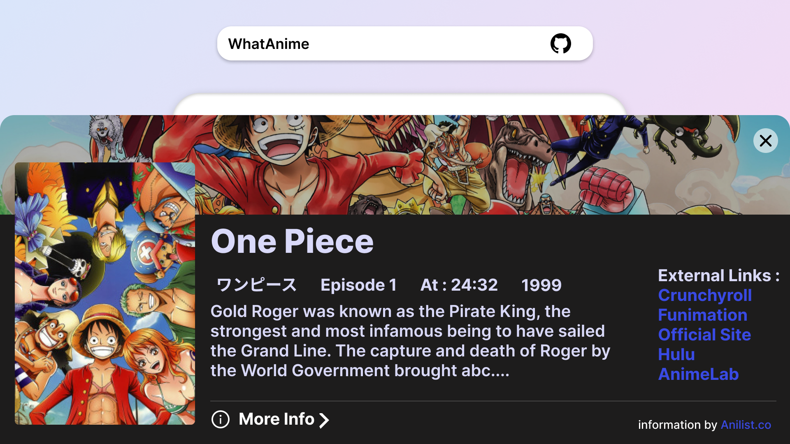

<!-- @format -->

<h1 align="center"> SauceKudasai ✨</h1>



<p>
  
  <a href="https://github.com/ayushgptaa/SauceKudasai#readme" target="_blank">
    
  </a>
  <a href="https://github.com/ayushgptaa/SauceKudasai/graphs/commit-activity" target="_blank">
    
  </a>
  <a href="https://twitter.com/ayushgptaa" target="_blank">
    
  </a>
    <a href="https://app.netlify.com/sites/saucekudasai/deploys" target="_blank">
    
  </a>
</p>

> A Frontend Search Engine that fetches anime info based on the image provided using <a href="https://trace.moe" target="_blank">trace.moe </a> and <a href="https://anilist.gitbook.io/anilist-apiv2-docs/" target="_blank"> Anilist</a> Api behind the scenes.

## Please Show your support to the origional Creater of the API if you want to... <a href="https://github.com/soruly"> @soruly</a>

<a style='font-size:2rem;' href="https://www.patreon.com/soruly"> Pateron Link</a> </br>
<a style='font-size:2rem;'  href='https://github.com/sponsors/soruly'>Github Sponser</a></br>
<a style='font-size:2rem;' href="https://www.paypal.com/paypalme/soruly/">Paypal Link</a> </br>

## Requirements 🧰

For development, you will only need Node.js and a node global package, npm or Yarn, installed in your environement.

## Install 📦

```sh
npm install
```

## Dev Server 🚀

```sh
npm run getsauce
```

## What I learned 🤓

-   React Context Api
-   Styled components
-   Graphql
-   Writing Resuseable Components
-   Clean code practice

## Author

👤 **Ayush Gupta**

-   Website: ayushguptaa.com
-   Twitter: [@ayushgptaa](https://twitter.com/ayushgptaa)
-   Github: [@ayushgptaa](https://github.com/ayushgptaa)
